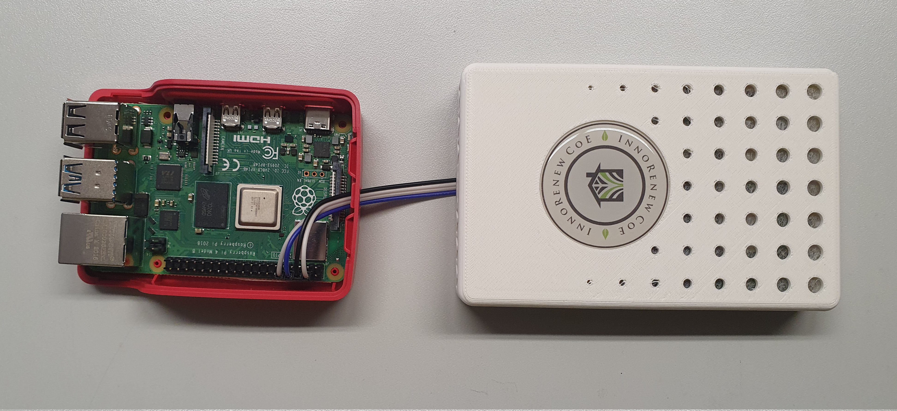

<div align="center" >
    <h1 >
      <span style="color: #FF1493" >IAQ-ARRS</span>
    </h1>
    <h3>
        IoT indoor air quality monitoring platform
    </h3>
    <h3>
        
        
  </h3>
  </div>
  <div align="left">
    <br>
    <a href="#">
        
	</a><br>
    <a href="#">
        
    </a>
	<br>
    <a href="#">
        
    </a>
</div>


# Table of contents


* [General info](#general-info)
* [Acknowledgments](#acknowledgments)
* [Technologies](#technologies)
* [Version](#version)
* [Documentation](#documentation) 
* [Image replication](#raspi-replication---base-image-creation)

  

# General info
  
In this repo we give an IoT indoor air quality monitoring platform that relies on raspberry PI devices and IAQ sensors to collect data from several buildings. The system is designed for high availability, high reliability, high data quality, maintainability, and plug and play operation. We mean plug and play operation, since devices can be configured, and then shipped (postal service) to a remote building where an operator could deploy the device by simply attaching it to a power outlet. The device will configure itslef and start collecting data.


# Acknowledgments

We would like to acknowledge the collegues Aleksandar Tošić[1,2], dr. Jernej Vičič[1], and prof. dr. Michael Mrissa[1,2] for the theoretical foundations, which are the basis for this implementation.
<br/>
<br/>
[1] University of Primorska, Faculty of Mathematics, Natural Sciences and Information Technologies
<br/>
[2] Innorenew CoE 

# Technologies
The project builds on:
* influxdb: 2,4,0
* docker: 20.10.17
	- linux-alpine: 3.15
* netperf: 2.7
* avahi: 0.8
* raspberryOs: debian-11-bullseye
* python
* mariadb: 10.4.24
* minimalmodbus
	
# Version

Version 1.0

# System architecture


The upper figure shows the main components of the system architecture. The server that runs the [influxdb](https://www.influxdata.com/) database and the reverse proxy. Moreover, the figure shows devices consisting of the raspberry PI and the IAQ sensor that are located in different LAN networks and are communicating with the server.


<br>
The following figure shows a detailed description of the device component and the communication device-server.
The device component consists of the data collection program, and several other components to ensure the high availability, maintainability and reliability of the system. 

#### Data collection component

The data collection component is a python program, running in a docker container. The component reads periodically the IAQ sensor via the UART protocol using the *minimalmodbus* library. The measurement is first converted into a value from the IEEE-754 representation, and then given to a queue. Another thread is reading the queue, and sending data to the server and the local database. The component relies on the queue to ensure that data is sent to the server even if the server cannot be reached for some time.

#### ssh-tunnel

An systemd service that maintains an ssh reverse tunnel to the server

#### hardware watchdog

The raspberry PI 4 has a hardware watchdog that can be enabled, to reboot the device if it gets stuck due to software or hardware issues it will restart the device even if the kernel crashes.

#### local database

An SQL database that stores the sensed data. We integrated the local database for future upgrade of the platform to allow distributed data processing.

#### telegraf

[Telegraf](https://www.influxdata.com/time-series-platform/telegraf/) is a plugin-driven agent for collecting and sending metrics. It is used to collect the state of devices and report it to the server. 


# Documentation

## Hardware requirements
 * 1 16Gb microSD Class 10 card
 * 1 raspberry Pi v4b + charger and case (extra hole to drill in the back of the red part over the SD card reader)
 * 1 Sensor


## Raspi-to-sensor wiring

The sensor is communicating with the raspberry PI using the UART protocol, therefore requiring two transmission cables, 5V, and common ground.
Sensors have two different wiring colors (yellow, orange, red, brown) and (purple, gray, white, black).
<br/>
The table below gives the correct wiring of the sensor to the raspberry PI.


| Raspberry PI | IAQ sensor - cables type 1 | IAQ sensor - cables type 2 |
| ------------ | ------------------- | ------------------- |
| GPIO 14 (tx) | yellow (rx)         | purple (rx)         |
| GPIO 15 (rx) | orange (tx)         | gray (tx)           |
| 5V           | red                 | white               |
| GND          | brown               | black               | 

### Some example figures

#### IAQ sensor - cables type 1


#### IAQ sensor - cables type 2 

Please, pay attention to distinguishing the gray and the white cable correctly.




## Install OS and setup basics

Install RaspiOS with raspi-imager.
* Mandatory: arm64 image.
* Use the image *2022-04-04-raspios-bullseye-arm64-lite.img.xz* OR *2022-04-04-raspios-bullseye-arm64.img.xz*

<br>

Install the Raspberry Pi imager program, start it.
Select "Use custom" and your raspi Pi image, to download [here](https://downloads.raspberrypi.org/raspios_arm64/images/raspios_arm64-2022-04-07/2022-04-04-raspios-bullseye-arm64.img.xz)

Click on the "configuration" icon (a little wheel in the bottom right corner) it opens a new window where you will select "always use" and then set your keyboard layout and language, enable SSH with "use password authentication" and leave the other options by default.

Select your SD card and click "Write"

### Allow UART communication

Copy the script *To_copy_in_boot/my_config.txt* in the *boot* foler of the SD card.
<br>
This script will enable the UART communication and disable some things that may disturb the communication.

### Setup SSH and WiFi

Copy *To_copy_in_boot/ssh* in the *boot* foler of the SD card.<br>
Configure and copy *To_copy_in_boot/wpa_supplicant.conf* in the *boot* folder of the SD card.
Additional network configuration description, and eduroam access configuration can be found [here](#network-connection-using-wpa_supplicant)


## SSH tunnel


Run the following command to generate ssh keys and press always enter

```
ssh-keygen
```

Store the SSH keys (private key: **id_rsa** public key: **id_rsa.pub**) in the folder */ssh_keys* in the root directory of the raspi.

### Move public key to the server

Follow the following [guide](https://www.digitalocean.com/community/tutorials/how-to-configure-ssh-key-based-authentication-on-a-linux-server) to copy the ssh public key to the authorized_keys directory on the server.
<br>

You must create the .ssh directory on the server. You must set ownership of .ssh and its files to the raspi user. The following commands may be useful:


```
sudo mkdir /home/raspi/.ssh
sudo su
cat raspi_public_key >>  /home/raspi/.ssh/authorized_keys
```

### Move server key to raspi

Copy the server public key to the */ssh_keys* folder on the raspi. The server's ssh public key must be named *server.pub*. 


## Create new user and set permissions and disable autologin

Please insert the SD card in the raspi and start the system.
Enter the user shell in some way.

### Create new user

Run the command 
```bash
sudo adduser iaq-sensor
````
Enter the password, and enter all default infos.

### Assign groups

Assign user groups of the pi user to the new user
Run the command:

```bash
groups | sed 's/pi //g' | sed 's/ /,/g' | xargs -I{} sudo usermod -a -G {} iaq-sensor
```

### Copy the pi home directory to the new user

Copy the home with:
```bash
sudo cp -R /home/pi/. /home/iaq-sensor
```

Change ownership with:
```bash
sudo chown -R iaq-sensor: /home/iaq-sensor
```

### Allow passwordless reboot for pssh

When updating the raspi remotely it can be useful to reboot the system through pssh without the password prompt.

```bash
sudo visudo
```
add the following lines to the `visudo` file

```plain
iaq-sensor ALL=(root)  NOPASSWD: /usr/sbin/reboot ""
iaq-sensor ALL=(root)  NOPASSWD: /usr/sbin/sync ""
```

### Mask the shutdown command

By executing this, the shutdown command is masked, and the raspi cannot be turned off!
```bash
sudo systemctl mask poweroff.target
```


### Reconfigure boot user and autologin

Prevent the user to turn off the raspberry PI, 
Log in as the new user
Run the command  
```bash 
sudo raspi-config
```

Got to `System options` then `boot / autologin` then select `B3`
Close and reboot

### Delete the pi user

Run the command 
```bash
sudo deluser --remove-home pi
```


## Enable the hardware watchdog

The raspi4 has a hardware watchdog, that can turn on the raspi also after kernel errors.

Modify the file 
```bash 
sudo nano /etc/systemd/system.conf
```

The following lines:
```bash
RuntimeWatchdogSec=14
ShutdownWatchdogSec=5min
```

!Attention!:
The line `RuntimeWatchdogSec=14` cannot be more than 15 seconds.

<br>
Reboot required

### Check if wathcdog active

```bash
dmesg | grep watchdog
```

## Network connection using wpa_supplicant

The raspberry pi needs internet access for the reverse proxy and to send data to the DB.
<br>
Here we describe the ordinary network configuration and the configuration for attaching to the [eduroam](https://eduroam.org/) network.

### Ordinary network configuration for WPA secured networks

Create the following wpa supplicant file with appropriately set *ssid* and *psk*, and move it to the /boot directory.
<br>


```bash
country=IT # Your 2-digit country code
ctrl_interface=DIR=/var/run/wpa_supplicant GROUP=netdev
update_config=1
network={
    ssid="networkID"
    psk="password"
    scan_ssid=1
    key_mgmt=WPA-PSK
}
```


### Eduroam network configuration

The eduroam service uses IEEE 802.1X EAP mode enterprise-grade authentication and a hierarchical system of RADIUS servers. Therefore, requires more configuration since the raspberry pi does not support advanced authentication methods out of the box. The configuration procedure was taken from the following [source](https://www.youtube.com/watch?v=oHVEwCEIzm4).  


#### Step-1-modify the network interface file

Modify the file *sudo nano /etc/network/interfaces* as follows:


```bash
# interfaces(5) file used by ifup(8) and ifdown(8)
# Include files from /etc/network/interfaces.d:
source /etc/network/interfaces.d/*

#add code below this line --------
auto lo
iface eth0 inet dhcp


auto wlan0
allow-hotplug wlan0
killall -q wpa_supplicant
iface wlan0 inet dhcp
 pre-up wpa_supplicant -B -D wext -i wlan0 -c /etc/wpa_supplicant/wpa_supplicant.conf
 post-down killall -q wpa_supplicant
```


#### Step-2-modify DHCP config file

Move to the bottom of the DHCP config file *sudo nano /etc/dhcpcd.conf* and add the following:

```bash

interface wlan0
env ifwireless = 1
env wpa_supplicant_driver = wext, nl80211

```


#### Step-3-create the wpa_supplicant.conf file

The file must be located in: */etc/wpa_supplicant/wpa_supplicant.conf*


```bash

ctrl_interface=DIR=/var/run/wpa_supplicant GROUP=netdev
update_config=1
country=SI

network={
        ssid="eduroam"
        proto=RSN
        key_mgmt=WPA-EAP
        pairwise=CCMP
        group=CCMP TKIP
        eap=TTLS
        altsubject_match="DNS:eduroam.upr.si;DNS:refosk2.upr.si"
        ca_cert="/home/iaq-sensor/eduroam/ca.pem"
        identity="userID"
        anonymous_identity="anonymousID"
        password="********"
        phase2="auth=PAP"
        priority=1
}

```


## Install the application


<br>

Install git and download the application

```
sudo apt-get install git
git clone https://github.com/nikih94/iaq-arrs
```


### Configuration file 


The sensor is configured by setting variables in the file *configuration_template.sh* to the appropriate values. The file must be then renamed to: *configuration.sh*
All variables are explained with comments.


### Installation scripts

#### Installation script 1

Run the first installation script with sudo: `sudo install_pt1.sh`
<br>
The script will perform the following:
- update system
- enable UART communication with sensor
- set timezone to Europe/Rome
- move ssh keys in the correct directory
- install docker
<br>
The system will automatically reboot after script execution. 

#### Installation script 2

Run the second installation script with sudo: `sudo install_pt2.sh`
<br>
The script will perform the following:
- add user to the docker group and install docker compose
- install telegraf
- create the unit file for setup & updates
- create unit file for network check
- enable systemd services
<br>


## Enable the overlay filesystem

The overlay filesystem can be easily enabled using the *raspi-config* tool; however, there are issues with using docker. The default docker filesystem driver cannot work with overlayFS, and docker tries to rename `/var/lib/docker/runtimes` while renames are not permitted using overlayFS. 
Therefore, using the overlayFS in combination with docker requires additional configuration. The following code sources from the following [github repo](https://github.com/asm/ansi_scroller#running-everything-on-a-read-only-filesystem).

```bash
#install the proper docker filesystem driver
sudo apt install -y fuse-overlayfs
#touch the docker config file
sudo touch /etc/docker/daemon.json
# enable the fuse-overlayfs
echo '{
  "storage-driver": "fuse-overlayfs"
}' | sudo tee /etc/docker/daemon.json
# Restart docker to pick up the changes
sudo service docker restart
# Start applications using docker
sudo systemctl start collect_data.service
# Now the important part: Stop docker and remove a directory it attempts to rename on boot.  OverlayFS doesn't support renaming.
#stop all docker services
sudo systemctl stop collect_data.service
sudo service docker stop
sudo rm -rf /var/lib/docker/runtimes
# Run raspi-config and enable overlayfs and read only /boot in "Performance Options", then reboot
sudo raspi-config
```

## Server setup

Guidelines on the server configuration can be found [here](server-README.md)


## Network latency plug-in

The network latency plug-in allows to measure the latency of the communication among devices located in the same LAN network. 
The plug-in was used in a gateway location optimization study, and can be easily enabled following the steps described [here](network-latency-README.md). 


# Raspi replication - Base image creation

To perform this section, you must have an SD card that was prepared following the steps in [raspi installation](raspi-installation)
<br>

### Schedule a re-setup

Delete the file /home/pi/status/configured.tmp
```
sudo rm /home/pi/status/configured.tmp
```
This will schedule a reconfiguration at the next system startup.

### Create the base image

Perform the following:
* Insert the SD card in the laptop.
* The SD card must NOT be mounted
* List all attacheed devices `sudo fdisk -l`
* Use the **dd** command to create a new image

```
sudo umount /dev/mmcblk0p1
sudo umount /dev/mmcblk0p2
less /proc/mounts |grep mm
sudo dd if=/dev/mmcblk0 of=./images/test.img
```

*Requires more or less 3.5mins*

<br>
Shrink image using [PiShrink](https://github.com/Drewsif/PiShrink)

```
sudo pishrink.sh -r ./images/test.img ./images/shrinked_test.img
```

## Image replication

Insert SD to overwrite in PC. Ensure, that the SD is not mounted. Run the command to copy the image to the sd:

```
sudo umount /dev/mmcblk0p1
sudo umount /dev/mmcblk0p2
less /proc/mounts |grep mm
sudo dd if=./images/shrinked_test.img of=/dev/mmcblk0
```
*Requires more or less 10mins*

### Setup the clone image

Mount the SD and perform the following:
<br>

Alter the configuration file by setting the **SENSOR_HOSTNAME** and **BUILDING** and **SERVER_PORT** building variable.


Create the *wpa_supplicant.conf* and copy, set it correctly and it into the *boot* folder.
<br>
**The clone is now ready**
<br>
Insert the SD card into the raspberry


